# 🏥 Service Desk Platform & IT Resource Management - Red UMSALUD

Plataforma corporativa integral diseñada para la gestión de incidencias IT, trazabilidad de usuarios y administración de recursos físicos para la Red UMSALUD. Desarrollada bajo una arquitectura modular y escalable, el sistema integra procesamiento en tiempo real, automatización de notificaciones y un motor de Inteligencia Artificial de inferencia local para optimizar flujos de soporte técnico.

## 🚀 Arquitectura y Tecnologías Core

El sistema está estructurado en 7 módulos interconectados, operando bajo un entorno híbrido (Local / Google Cloud) con soporte para túneles SSH.

* **Frontend:** Angular (Renderizado dinámico, Chart.js/ECharts).
* **Backend:** Laravel, Node.js (Microservicios).
* **Comunicaciones & Eventos:** Laravel Echo, WebSockets, Event-Driven Architecture, Laravel Queues.
* **Inteligencia Artificial:** Ollama (Motor de inferencia local), Prompt Engineering, Arquitectura RESTful.
* **Bases de Datos & Patrones:** RBAC (Control de acceso), Patrón State, Soft Deletes (Auditoría Forense).

## 🧩 Estructura Modular

### 1. Gestión de Identidades, Seguridad y Trazabilidad (M1)
Núcleo de confianza del sistema basado en el patrón **RBAC**. Incluye autenticación centralizada (Laravel Sanctum), registro inmutable para trazabilidad forense y un sistema de *Soft Delete* para mantener la integridad del directorio de usuarios sin comprometer datos históricos.

### 2. Gestión de Incidencias y Soporte Técnico (M2)
El motor operativo del proyecto. Clasifica automáticamente los tickets cruzando Impacto y Urgencia bajo el estándar **ITIL** para determinar los niveles de servicio (SLA). Integra un chat técnico en tiempo real impulsado por **WebSockets** y gestión del ciclo de vida del ticket mediante el Patrón State.

### 3. Repositorio Técnico Digital (M3)
Base de conocimientos estructurada jerárquicamente. Utiliza Laravel Storage Facade y validación MIME para gestionar el almacenamiento seguro de activos digitales, con visibilidad segmentada (Público/Técnico) y un centro de recuperación.

### 4. Asistente Virtual con Inteligencia Artificial (M4)
Interfaz de atención de Nivel 1 basada en Procesamiento de Lenguaje Natural (NLP). Desplegado mediante **Ollama** para inferencia local, resuelve dudas frecuentes y actúa como puente de derivación hacia el soporte técnico humano.

### 5. Gestión de Reservas de Ambientes (M5)
Motor lógico de administración de infraestructura física. Utiliza algoritmos de prevención de traslapes y validación temporal (Carbon) para evitar colisiones de horarios y gestionar solicitudes con flujos de aprobación administrativa.

### 6. Notificaciones Multicanal (M6)
Motor de mensajería asíncrono desacoplado. Utiliza **Laravel Queues** y un microservicio en **Node.js** para integrar la API de WhatsApp, enviando alertas críticas en tiempo real junto con un centro de notificaciones in-app.

### 7. Reportes Estadísticos e Inteligencia de Negocios (M7)
Dashboards dinámicos para la toma de decisiones. Calcula KPIs técnicos (como MTTR) y exporta reportes con validez administrativa mediante DomPDF y Maatwebsite Laravel-Excel.
## 📸 Visualización de la Plataforma

| Auditoría | Chatbot | Chat en Vivo |
| :---: | :---: | :---: |
| 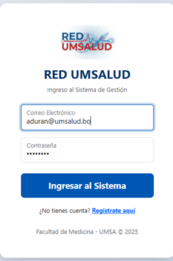 | 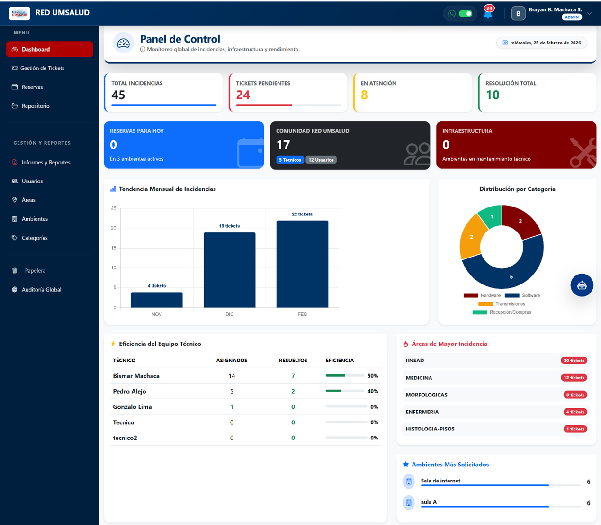 | 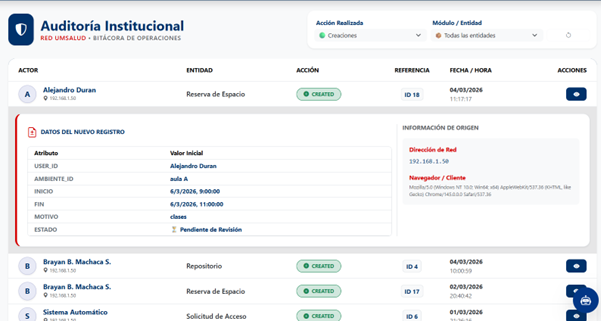 | 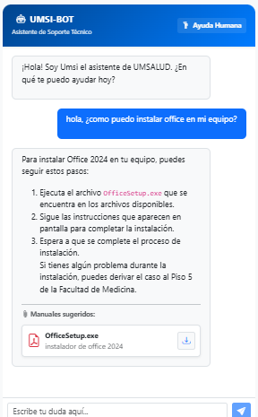 | 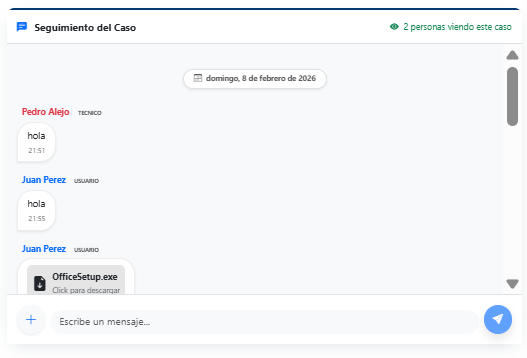 |
| **Dashboard** | **Detalles de Ticket** | **Lista de Tickets** |
| 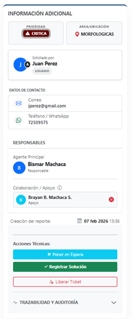 | 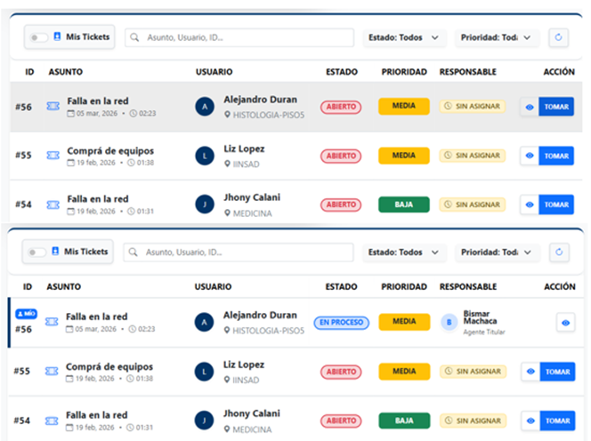 |
| **Lista de Usuarios** | **Login** | **Notificaciones** |
| 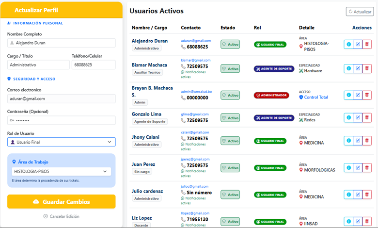 | 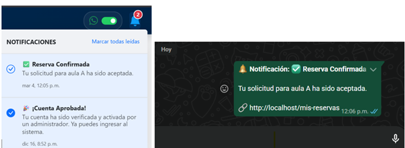 |
| **Papelera** | **Reportes** | **Repositorio** |
| 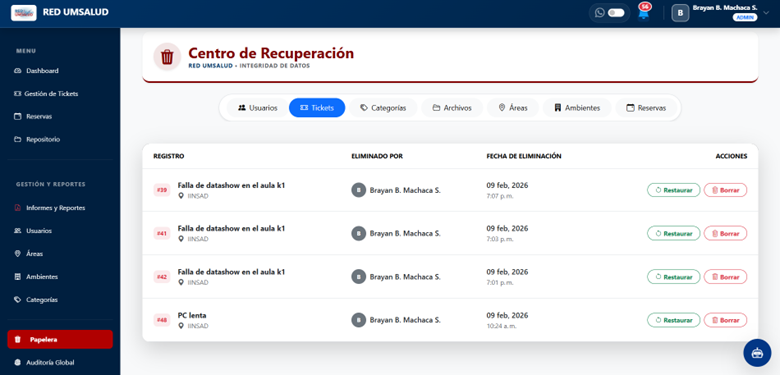 | 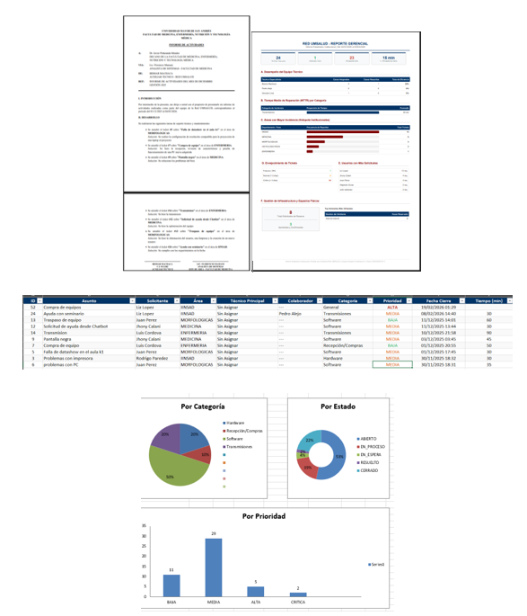 | 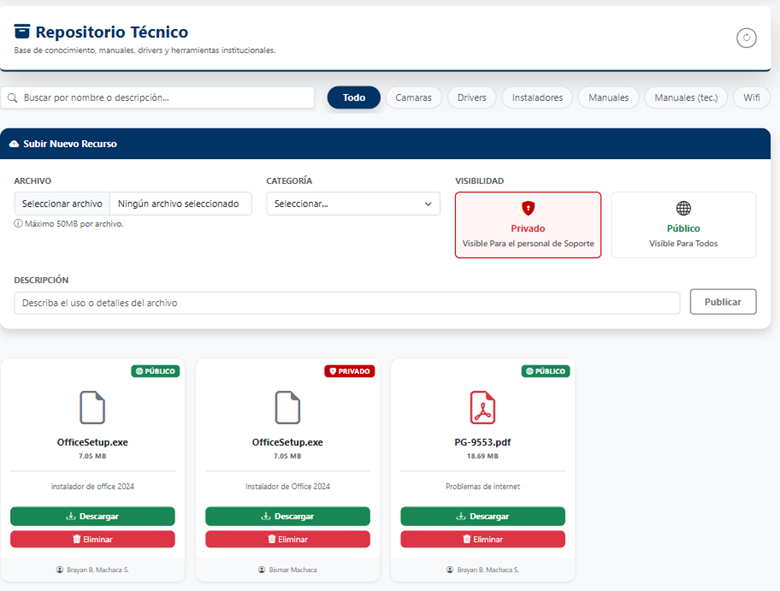 |
| **Reservas de Ambientes** | | |
| 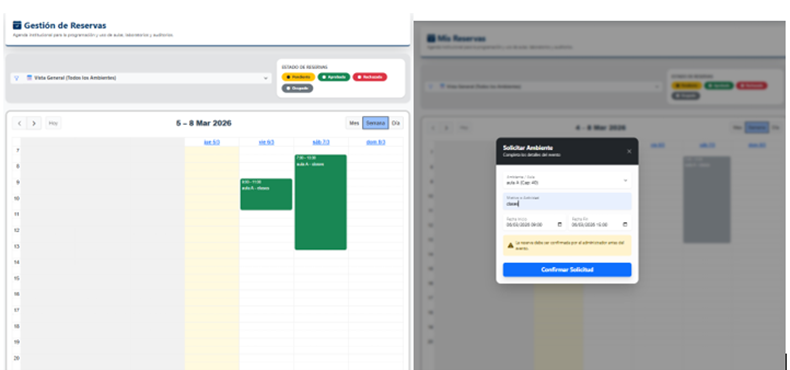 | | |

### 1. Preparación de Dependencias
Ejecuta estos comandos en sus carpetas correspondientes:

# Backend (Laravel)
cd backend
cp .env.example .env
composer install
php artisan key:generate
php artisan migrate --seed

# Frontend (Angular)
cd frontend
npm install

# Microservicio WhatsApp
cd whatsapp-api
npm install

### 2. Ejecución de Servicios
Debes abrir 6 terminales diferentes y ejecutar cada comando:

# Terminal 1: Servidor Backend
cd backend && php artisan serve --host=0.0.0.0 --port=8000

# Terminal 2: Cliente Frontend
cd frontend && ng serve --host 0.0.0.0 --allowed-hosts=all

# Terminal 3: WebSockets
cd backend && php artisan reverb:start --port=8081

# Terminal 4: Colas
cd backend && php artisan queue:work

# Terminal 5: API WhatsApp
cd whatsapp-api && node index.js

# Terminal 6: IA Local
ollama run gemma3:4b
